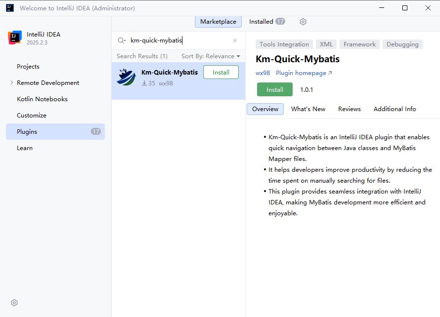

# [![km-quick-mybatis][plugin-logo]][gh:km-quick-mybatis] km-quick-mybatis

[![Plugin Homepage][badge:plugin-homepage]][plugin-homepage]
[![Build Status][badge:build]][gh:workflows-build]
[![License][badge:license]][gh:license]
[![GitHub releases][badge:release]][gh:releases]
[![Version][badge:version]][plugin-versions]
[![Downloads][badge:downloads]][plugin-homepage]
[![JavaVersion][badge:JavaVersion]][gh:JavaVersion]
[![IntelliJPlatform][badge:intelliJ-platform]][gh:intelliJ-platform]
[![Last Commit][badge:last-commit]][gh:last-commit]
[![Last Issues][badge:last-issues]][gh:last-issues]

<b>Java and MyBatisXml jump plugin based on IntelliJ IDEs/Android Studio.</b>

[![Getting Started][badge:get-started-en]][get-started-en]
[![开始使用][badge:get-started-zh]][get-started-zh]
---

<!-- Plugin description -->

* Km-Quick-Mybatis is an IntelliJ IDEA plugin that enables quick navigation between Java classes and MyBatis Mapper files.
* It helps developers improve productivity by reducing the time spent on manually searching for files.
* This plugin provides seamless integration with IntelliJ IDEA, making MyBatis development more efficient and enjoyable.

<!-- Plugin description end -->

## Installation
### Using JetBrains Marketplace:
  

- Go to [JetBrains Marketplace](https://plugins.jetbrains.com/plugin/29383-km-quick-mybatis) and install it by clicking the <kbd>Install to ...</kbd> button in case your IDE is running.

### 使用 IDE 内置插件系统：
- <kbd>Settings/Preferences</kbd> → <kbd>Plugins</kbd> → <kbd>Marketplace</kbd> → <kbd>Search for "km-quick-mybatis"</kbd> → <kbd>Install</kbd>  
  

### 从 JetBrains 插件市场下载安装：
- You can also download the [latest release](https://plugins.jetbrains.com/plugin/29383-km-quick-mybatis/versions) from JetBrains Marketplace
- install it manually using <kbd>Settings/Preferences</kbd> → <kbd>Plugins</kbd> → <kbd>⚙️</kbd> → <kbd>Install plugin from disk...</kbd>

### 从 Git Releases 下载安装：
- Download the [latest release](https://github.com/wx98/km-quick-mybatis/releases/latest) and install it manually using
- <kbd>Settings/Preferences</kbd> → <kbd>Plugins</kbd> → <kbd>⚙️</kbd> → <kbd>Install plugin from disk...</kbd>

---
Plugin based on the [IntelliJ Platform Plugin Template][template].

[template]: https://github.com/JetBrains/intellij-platform-plugin-template

[plugin-logo]: src/main/resources/images/icon-32.svg
[plugin-homepage]: https://plugins.jetbrains.com/plugin/29383-km-quick-mybatis
[plugin-versions]: https://plugins.jetbrains.com/plugin/29383-km-quick-mybatis

[badge:plugin-homepage]: https://img.shields.io/badge/plugin%20homepage-km--quick--mybatis-4caf50.svg?style=flat-square
[badge:build]: https://img.shields.io/github/actions/workflow/status/wx98/km-quick-mybatis/build.yml?branch=main&label=build&style=flat-square
[badge:license]: https://img.shields.io/github/license/wx98/km-quick-mybatis.svg?style=flat-square
[badge:version]: https://img.shields.io/jetbrains/plugin/v/29383-km-quick-mybatis.svg
[badge:downloads]: https://img.shields.io/jetbrains/plugin/d/29383-km-quick-mybatis.svg?style=flat-square&colorB=5C6BC0
[badge:release]: https://img.shields.io/github/release/wx98/km-quick-mybatis.svg?sort=semver&style=flat-square&colorB=0097A7
[badge:JavaVersion]: https://img.shields.io/badge/Java-17-blue.svg
[badge:intelliJ-platform]: https://img.shields.io/badge/IntelliJ%20Platform-2023.1%2B-blue.svg
[badge:last-commit]: https://img.shields.io/github/last-commit/wx98/km-quick-mybatis.svg
[badge:last-issues]: https://img.shields.io/github/issues/wx98/km-quick-mybatis.svg
[badge:get-started-en]: https://img.shields.io/badge/Get%20Started-English-4CAF50?style=flat-square
[badge:get-started-zh]: https://img.shields.io/badge/%E5%BC%80%E5%A7%8B%E4%BD%BF%E7%94%A8-%E4%B8%AD%E6%96%87-2196F3?style=flat-square

[gh:km-quick-mybatis]: https://github.com/wx98/km-quick-mybatis
[gh:workflows-build]: https://github.com/wx98/km-quick-mybatis/actions/workflows/build.yml
[gh:releases]: https://github.com/wx98/km-quick-mybatis/releases
[gh:license]: https://github.com/wx98/km-quick-mybatis/blob/main/LICENSE
[gh:JavaVersion]: https://jdk.java.net/archive/
[gh:intelliJ-platform]: https://plugins.jetbrains.com/docs/intellij/build-number-ranges.html
[gh:last-commit]: https://github.com/wx98/km-quick-mybatis/commits/main
[gh:last-issues]: https://github.com/wx98/km-quick-mybatis/issues

[get-started-en]: https://github.com/wx98/km-quick-mybatis/blob/main/README.md
[get-started-zh]: https://github.com/wx98/km-quick-mybatis/blob/main/README_zh.md

[template]: https://github.com/JetBrains/intellij-platform-plugin-template
